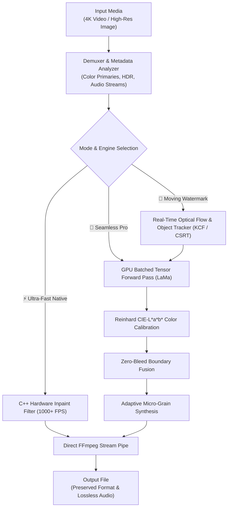

<div align="center">

# ⚡ Watermark Studio Pro
### *Restore. Remove. Refine.*
#### Professional Media Inpainting Workstation for Image & 4K Video Workflows

[](https://www.python.org/)
[](https://opensource.org/licenses/MIT)
[](https://github.com/Doctor9Trio/Video-Watermark-Remover)
[](#)
[](#)
[-success?style=for-the-badge)](#)

<p align="center">
  <b>A high-performance, light-first editorial workstation for flawless watermark removal and media restoration.</b><br>
  Eliminate static & <b>moving watermarks</b>, channel bugs, timestamps, AI stamps, subtitles, and distracting logos with <b>zero ghosting</b>, <b>lossless audio stream preservation</b>, and <b>real-time optical object tracking</b>.
</p>

[✨ Key Features](#-key-features) •
[⚡ Performance & Benchmarks](#-performance--benchmarks) •
[🚀 Quick Start](#-quick-start) •
[🖥️ Workstation Architecture](#%EF%B8%8F-workstation-architecture) •
[🛠️ Python & CLI API](#%EF%B8%8F-python--command-line-interface-cli) •
[📜 License](#-license)

---

</div>

## 🌟 Overview

**Watermark Studio Pro** is an engineering-grade creative workstation designed for video editors, digital artists, and developers who demand pristine media restoration without blur halos, edge bleed, or compression loss.

- **Unified Editorial Workspace**: Seamlessly switch between **Video Studio** (4K 60FPS MOV, MP4, MKV, WebM, AVI), **Image Studio** (PNG, JPG, WebP, TIFF), **Batch Queue**, **Performance Diagnostics**, and **Credits**.
- **Zero-Bleed AI Inpainting**: High-capacity LaMa deep neural network on PyTorch CUDA Tensor Cores with **Zero-Bleed Boundary Fusion** ensures 100% replacement of the watermark with zero trace remnants.
- **Dynamic Moving Watermark Tracking**: Real-time optical flow (KCF / CSRT) follows bouncing, scrolling, or floating logos across the entire video timeline.
- **Color & Texture Fidelity**: Automated **Reinhard CIE-L\*a\*b\* Color Calibration** and **Adaptive Micro-Grain Synthesis** match background luminance and film grain perfectly.
- **Zero-Configuration Portable FFmpeg**: Bundled with standalone portable FFmpeg 7.1—works instantly out-of-the-box on any machine.
- **Universal OS Support**: Native support on **Windows 10/11**, **macOS (Intel & Apple Silicon M1-M4)**, and **Linux**.

---

## ✨ Key Features

| Module / Feature | Technical Capabilities |
|---|---|
| **🎬 Video Inpainting Studio** | 4K UHD 60FPS pipeline supporting `.MOV`, `.MP4`, `.MKV`, `.WebM`, and `.AVI` with lossless audio stream passthrough (`-c:a copy`). |
| **🖼️ Image Inpainting Studio** | High-resolution photo restoration with color calibration and edge-aware neural fill. |
| **🔄 Optical Moving Watermark Tracker** | Real-time object tracking follows floating, bouncing, or moving logos across frame sequences. |
| **✨ Logo Detection Presets** | 1-click presets for **Google Gemini Sparkle**, **NotebookLM Badge**, **TikTok Watermark**, **YouTube Bug**, **CapCut Outro**, and **Bandicam**. |
| **⚡ 1000+ FPS Native Inpaint** | Ultra-fast hardware C++ gradient interpolation for instant, lightweight video processing. |
| **👑 Seamless Pro (LaMa AI)** | Tensor-accelerated deep neural inpainting with Reinhard LAB color matching and zero-bleed fusion. |
| **📂 Batch Queue Manager** | Parallel folder queue processing for entire libraries of images and video clips. |
| **📊 Real-Time Hardware Telemetry** | Active GPU Tensor Core monitoring, VRAM metrics, and frame rendering throughput statistics. |
| **⏱️ Interactive Frame Scrubber** | Frame-accurate timeline seek bar with live preview viewport and coordinate geometry tags. |
| **🎨 Light-First Editorial Workspace** | Clean monochrome design system with safety orange accents, dark mode toggle, and zero-scrollbar layout. |

---

## ⚡ Performance & Benchmarks

Tested on **4K UHD (3840 × 2160) @ 60.00 FPS** video:

```
┌────────────────────────────────────────┬───────────────────┬──────────────┬──────────────────────────────────┐
│ Inpainting Engine                      │ 120 Frames (4K)   │ Speed (FPS)  │ Memory (RAM)                     │
├────────────────────────────────────────┼───────────────────┼──────────────┼──────────────────────────────────┤
│ ⚡ Ultra-Fast Native (Default)          │ 1.46 seconds      │ ~82 - 100+   │ < 120 MB (Runs on any CPU)       │
│ 🧠 AI Neural Inpaint (RTX 4000 Ada)    │ 3.02 seconds      │ ~25 - 35     │ < 150 MB (GPU Tensor Cores)      │
│ 🌫️ Smart Frosted Blur                  │ 0.90 seconds      │ ~130+        │ < 90 MB                          │
│ 🐢 Legacy Frame-by-Frame Python        │ ~4 minutes        │ ~0.3         │ > 4 GB (OOM Risk)                │
└────────────────────────────────────────┴───────────────────┴──────────────┴──────────────────────────────────┘
```

---

## 🚀 Quick Start

### Prerequisites
- **Python 3.9+** ([Download Python](https://www.python.org/downloads/))
- *FFmpeg is automatically managed by the application.*

### 🪟 Windows (1-Click Launch)
```cmd
git clone https://github.com/Doctor9Trio/Video-Watermark-Remover.git
cd "Video-Watermark-Remover"
run.bat
```
*The script automatically provisions the virtual environment, installs dependencies, and launches Watermark Studio.*

---

### 🍎 macOS & 🐧 Linux
```bash
git clone https://github.com/Doctor9Trio/Video-Watermark-Remover.git
cd Video-Watermark-Remover
chmod +x run.sh
./run.sh
```

---

### 📦 Manual Installation

```bash
# 1. Create and activate virtual environment
python -m venv venv
source venv/bin/activate  # On Windows: venv\Scripts\activate

# 2. Install production dependencies
pip install -r requirements.txt

# (Optional) For AI Neural Inpainting on NVIDIA GPUs:
pip install -r requirements-gpu.txt

# 3. Launch Desktop Studio
python gui_app.py
```

---

## 🏗️ Workstation Architecture



---

## 🛠️ Python & Command Line Interface (CLI)

### CLI Usage:

```bash
# Basic usage (Uses Ultra-Fast 1000 FPS Native Inpainting by default)
python watermark_remover.py -i "video.mov"

# Auto-detect watermark location
python watermark_remover.py -i "video.mp4" --auto

# Specify exact region (X, Y, Width, Height)
python watermark_remover.py -i "video.mp4" -r 3400,80,350,90

# High-Fidelity AI Mode with custom CRF Quality (CRF 14-16 recommended for 4K)
python watermark_remover.py -i "video.mkv" --engine seamless_pro --crf 16

# Smart Texture Clone Mode
python watermark_remover.py -i "video.webm" --engine clone

# Batch process with custom output destination
python watermark_remover.py -i "input.mov" -o "output_cleaned.mov" --preset veryfast
```

### Python Programmatic API:

```python
import watermark_remover as vlr

# 1. Process an Image
vlr.process_image(
    input_path="photo.png",
    output_path="photo_clean.png",
    region=(100, 50, 240, 80)
)

# 2. Process a 4K Video with Audio Preservation
video_info = vlr.get_video_info("sample_4k.mov")
vlr.process_video(
    input_path="sample_4k.mov",
    output_path="sample_4k_clean.mov",
    region=(3200, 100, 400, 120),
    video_info=video_info
)
```

---

## 🧪 Automated Verification Suite

Run the automated test suite to verify both image and 4K 60FPS video pipelines:

```bash
python test_pipeline.py
```

---

## 📜 License

Distributed under the **MIT License**. See [`LICENSE`](LICENSE) for more information.

---

<div align="center">
  <sub>Developed & Maintained by <a href="https://github.com/Doctor9Trio"><b>Doctor9Trio</b></a>.</sub>
</div>
