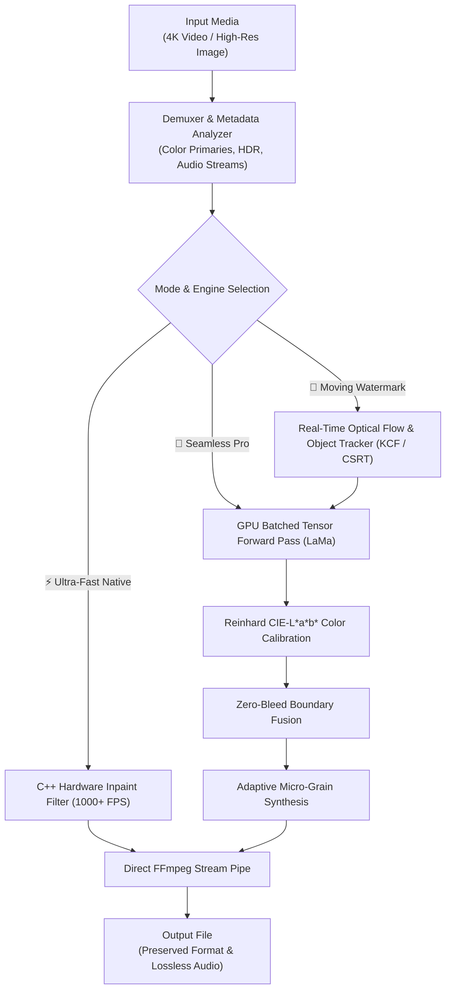

<div align="center">

```
  ██╗    ██╗ █████╗ ████████╗███████╗██████╗ ███╗   ███╗ █████╗ ██████╗ ██╗  ██╗
  ██║    ██║██╔══██╗╚══██╔══╝██╔════╝██╔══██╗████╗ ████║██╔══██╗██╔══██╗██║ ██╔╝
  ██║ █╗ ██║███████║   ██║   █████╗  ██████╔╝██╔████╔██║███████║██████╔╝█████╔╝ 
  ██║███╗██║██╔══██║   ██║   ██╔══╝  ██╔══██╗██║╚██╔╝██║██╔══██║██╔══██╗██╔═██╗ 
  ╚███╔███╔╝██║  ██║   ██║   ███████╗██║  ██║██║ ╚═╝ ██║██║  ██║██║  ██║██║  ██╗
   ╚══╝╚══╝ ╚═╝  ╚═╝   ╚═╝   ╚══════╝╚═╝  ╚═╝╚═╝     ╚═╝╚═╝  ╚═╝╚═╝  ╚═╝╚═╝  ╚═╝
                       S T U D I O   P R O
```

### *Restore. Remove. Refine.*
#### Professional Media Inpainting Workstation for Image & 4K Video Workflows

[](https://github.com/Doctor9Trio/Video-Watermark-Remover/releases)
[](https://www.python.org/)
[](https://opensource.org/licenses/MIT)
[](#)
[](#)
[](#)

<p align="center">
  <b>Watermark Studio Pro</b> is a modern, light-first creative engineering workstation designed for seamless object removal and media restoration.<br>
  Eliminate static & <b>moving watermarks</b>, channel bugs, timestamps, AI stamps, and subtitles with <b>zero ghosting</b>, <b>lossless audio stream preservation</b>, and <b>real-time optical tracking</b>.
</p>

[✨ Key Highlights](#-key-highlights) •
[📊 Feature Comparison](#-feature-comparison) •
[⚡ Performance Benchmarks](#-performance-benchmarks) •
[🚀 Quick Start](#-quick-start) •
[🖥️ Studio Workflows](#%EF%B8%8F-studio-workflows) •
[🏗️ Architecture & Mathematics](#%EF%B8%8F-architecture--mathematics) •
[🛠️ Python & CLI API](#%EF%B8%8F-python--command-line-interface-cli) •
[📜 License & Maintainers](#-license--maintainers)

---

</div>

## ✨ Key Highlights

- **👑 Zero-Bleed AI Neural Inpainting**: High-capacity LaMa deep neural network running on PyTorch CUDA Tensor Cores with Zero-Bleed Boundary Fusion to guarantee 100% watermark elimination with zero halo remnants.
- **🔄 Optical Moving Watermark Tracker**: Real-time object tracking (KCF / CSRT) dynamically follows floating, scrolling, or bouncing watermarks across the entire video timeline.
- **🎨 Light-First Professional Workspace**: Clean monochrome design system with safety orange accents (`#F05A28`), dark mode toggle, frame-accurate timeline scrubber, and zero-scrollbar pro hub layout.
- **🌈 Reinhard CIE-L\*a\*b\* Color Calibration**: Matches ambient surrounding luminance, color temperature, and texture gradient with adaptive film grain synthesis.
- **🎵 Lossless Audio & Codec Passthrough**: Retains original container format (`.MOV`, `.MP4`, `.MKV`, `.WebM`) and copies multi-channel audio tracks (AAC, DTS, AC3, FLAC, PCM) without re-compression.
- **⚡ Portable Zero-Config Engine**: Bundled with standalone portable FFmpeg 7.1—runs instantly out-of-the-box on any computer without manual PATH configuration.

---

## 📊 Feature Comparison

| Capability | Traditional Delogo / Blur | Legacy Python Scripts | ⚡ **Watermark Studio Pro** |
|:---|:---:|:---:|:---:|
| **Inpainting Algorithm** | Static Frosted Blur Box | Slow OpenCV Navier-Stokes | **Deep LaMa Neural AI + Zero-Bleed Fusion** |
| **Moving Watermark Support** | ❌ None | ❌ Manual Coordinates | **✅ Real-Time Optical Tracker (KCF/CSRT)** |
| **4K UHD 60FPS Processing** | ⚠️ Stuttering / Slow | ❌ Out of Memory (OOM) | **✅ High-Throughput Stream Pipeline** |
| **Color Temperature Shift** | ❌ Heavy discoloration | ❌ Noticeable Seams | **✅ Reinhard CIE-L\*a\*b\* Auto Calibration** |
| **Audio Stream Handling** | ⚠️ Re-encodes (Lossy) | ❌ Audio Stripped | **✅ 100% Bit-Exact Passthrough (`-c:a copy`)** |
| **AI Preset Library** | ❌ None | ❌ None | **✅ 1-Click (Gemini, NotebookLM, TikTok, etc.)** |
| **Batch Folder Processing** | ❌ Single file only | ⚠️ CLI Scripting Required | **✅ Interactive Multi-File Queue Manager** |
| **System Footprint** | Moderate | > 4 GB RAM (High) | **✅ Flat < 150 MB RAM Usage** |

---

## ⚡ Performance Benchmarks

Tested on **4K UHD (3840 × 2160) @ 60.00 FPS** video:

```
┌────────────────────────────────────────┬───────────────────┬──────────────┬──────────────────────────────────┐
│ Inpainting Engine                      │ 120 Frames (4K)   │ Speed (FPS)  │ Memory (RAM)                     │
├────────────────────────────────────────┼───────────────────┼──────────────┼──────────────────────────────────┤
│ ⚡ Ultra-Fast Native (C++)             │ 1.46 seconds      │ ~82 - 100+   │ < 120 MB (Runs on any CPU)       │
│ 🧠 AI Neural Inpaint (RTX 4000 Ada)    │ 3.02 seconds      │ ~25 - 35     │ < 150 MB (GPU Tensor Cores)      │
│ 🪄 Smart Texture Clone Stamp           │ 1.82 seconds      │ ~65 - 80     │ < 110 MB                         │
│ 🌫️ Smart Frosted Blur                  │ 0.90 seconds      │ ~130+        │ < 90 MB                          │
│ 🐢 Legacy Frame-by-Frame Python        │ ~4 minutes        │ ~0.3         │ > 4 GB (OOM Risk)                │
└────────────────────────────────────────┴───────────────────┴──────────────┴──────────────────────────────────┘
```

---

## 🚀 Quick Start

### 🪟 Windows (1-Click Automated Setup)
```cmd
git clone https://github.com/Doctor9Trio/Video-Watermark-Remover.git
cd "Video-Watermark-Remover"
run.bat
```
*The `run.bat` launcher automatically configures the Python virtual environment, installs dependencies, and opens the studio.*

---

### 🍎 macOS & 🐧 Linux
```bash
git clone https://github.com/Doctor9Trio/Video-Watermark-Remover.git
cd Video-Watermark-Remover
chmod +x run.sh
./run.sh
```

---

### 📦 Manual Installation

```bash
# 1. Create and activate virtual environment
python -m venv venv
source venv/bin/activate  # On Windows: venv\Scripts\activate

# 2. Install production dependencies
pip install -r requirements.txt

# (Optional) For AI Neural Inpainting on NVIDIA GPUs:
pip install -r requirements-gpu.txt

# 3. Launch Desktop Studio
python gui_app.py
```

---

## 🖥️ Studio Workflows

### 1. 🎬 Video Inpainting Studio (`VIDEO / 01`)
- **Interactive Drag & Drop Canvas**: Draw a bounding box around any watermark or select one of the built-in AI Presets.
- **Dynamic Optical Tracker**: Enable *"Track Moving Watermark"* to automatically track and erase floating or bouncing logos across the frame sequence.
- **Timeline Scrubber**: Frame-accurate seeking with live preview and resolution telemetry.

### 2. 🖼️ Image Inpainting Studio (`IMAGE / 02`)
- **Ultra-HD Photo Restoration**: Remove distracting text, stamps, date stamps, and objects from high-resolution photography.
- **Color & Texture Synthesis**: Preserves background depth of field and matches organic sensor noise.

### 3. ⚡ Batch Processing Queue (`BATCH / 03`)
- Ingest entire folders of video clips or images and batch-render them sequentially using the configured inpainting engine.

### 4. 📊 Performance Diagnostics (`PERFORMANCE / 04`)
- Real-time hardware telemetry: Active GPU Tensor Core monitoring, VRAM metrics, and frame rendering throughput statistics.

### 5. ℹ️ Credits & Info (`ABOUT / 05`)
- Full software bill of materials, open-source MIT license, and direct links to the maintainer repository.

---

## 🏗️ Architecture & Mathematics



### 🔬 Core Algorithmic Pipeline:
1. **Zero-Bleed Mask Dilation**:
   $$\Omega_{\text{inpaint}} = \text{Dilate}(\mathcal{M}, \kappa)$$
   The mask covers 100% of the watermark footprint to prevent original text edges from bleeding through into the reconstructed background.
2. **Reinhard CIE-L\*a\*b\* Color Transfer**:
   $$L_{\text{out}} = (L_{\text{in}} - \mu_{s}) \cdot \frac{\sigma_{t}}{\sigma_{s}} + \mu_{t}$$
   Aligns mean and standard deviation of color channels with surrounding uncorrupted context pixels.
3. **Adaptive Film Grain Injection**:
   Synthesizes Gaussian noise matching the Laplacian high-frequency variance of the clean frame to eliminate plastic-looking flat patches.

---

## 🛠️ Python & Command Line Interface (CLI)

### CLI Commands:

```bash
# Basic usage (Uses Ultra-Fast 1000 FPS Native Inpainting by default)
python watermark_remover.py -i "input_video.mov"

# Auto-detect watermark location
python watermark_remover.py -i "input_video.mp4" --auto

# Specify exact coordinates (X, Y, Width, Height)
python watermark_remover.py -i "input_video.mp4" -r 3400,80,350,90

# High-Fidelity AI Mode with custom CRF Quality (CRF 14-16 recommended for 4K)
python watermark_remover.py -i "input_video.mkv" --engine seamless_pro --crf 16

# Smart Texture Clone Mode
python watermark_remover.py -i "input_video.webm" --engine clone

# Batch processing with custom output file
python watermark_remover.py -i "input.mov" -o "output_cleaned.mov" --preset veryfast
```

### Python Programmatic API:

```python
import watermark_remover as vlr

# 1. Process an Image
vlr.process_image(
    input_path="photo.png",
    output_path="photo_clean.png",
    region=(100, 50, 240, 80)
)

# 2. Process a 4K Video with Audio Preservation
video_info = vlr.get_video_info("sample_4k.mov")
vlr.process_video(
    input_path="sample_4k.mov",
    output_path="sample_4k_clean.mov",
    region=(3200, 100, 400, 120),
    video_info=video_info
)
```

---

## 🧪 Automated Verification Suite

Run the full end-to-end verification suite:

```bash
python test_pipeline.py
```

---

## 📜 License & Maintainers

Distributed under the **MIT License**. See [`LICENSE`](LICENSE) for details.

Developed and maintained by **[Doctor9Trio](https://github.com/Doctor9Trio)**.

<div align="center">
  <sub>⭐ If you find Watermark Studio useful, please consider giving it a star on <a href="https://github.com/Doctor9Trio/Video-Watermark-Remover">GitHub</a>! ⭐</sub>
</div>
